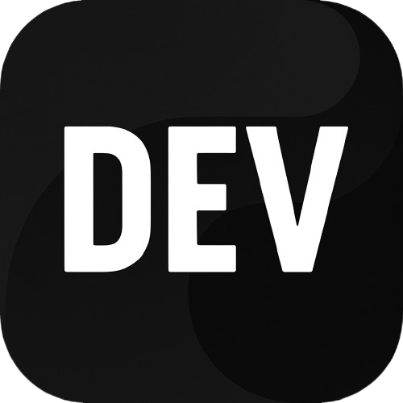

<!-- Typing SVG -->
<h1 align="center">
    
     
    
</h1>

<!-- Redes Sociais -->

    <!-- linkedin -->
    
    &#8287;
    <!-- instagram -->
    
    &#8287;
    <!-- x -->    
    
    &#8287;
    <!-- gmail -->  
    
    &#8287;
    <!-- spotify -->    
    
    &#8287;
    <!-- discord -->
    
    &#8287;
    <!-- dev community -->
    
    &#8287;

<!-- Sobre mim -->

    Atualmente estou cursando a <b>formação Full Stack</b> da <b><a href="https://www.rocketseat.com.br/formacao/fullstack" target="_blank">Rocketseat</a></b> onde venho estudando as bases sólidas do desenvolvimento web: <b>HTML, CSS, JavaScript,</b> além de conceitos modernos como <b>componentização, versionamento com Git, consumo de APIs,</b> e muito mais que faz parte do <b><a href="https://roadmap.sh/full-stack?s=67f6fd1f46da096541ba755b" target="_blank">Roadmap.sh</a></b>
     
     
    Sou apaixonado por tecnologia, <b>gosto de entender como as coisas funcionam e busco sempre aprender algo novo</b> — seja com cursos, livros ou na prática com código. No meu tempo livre, curto jogos, leitura (temas como produtividade e filosofia de vida, ficção científica), e <b>venho aprendendo inglês</b> como parte do meu <b>crescimento pessoal e profissional.</b>

<!-- Badges Icons GitHub -->

    <!-- Stars -->
    
    <!-- Seguindo -->    
    
    <!-- Acessos -->    
    

---

<!-- Icons Linguagens e Ferramentas -->
<h2 align="center">🔥 Linguagens & Ferramentas 🔥</h2>

    <code></code>
    <code></code>
    <code></code>
    <code></code>
    <code></code>
    <code></code>
    <code></code>
    <code></code>
    <code></code>
    <code></code>

---

<!-- GitHub Stats -->
<h2 align="center">⚡ GitHub Stats ⚡</h2>

    
    

    
    

---

<!-- GitHub Conquistas -->
<h2 align="center">🏅 Conquistas 🏅</h2>

  

---
